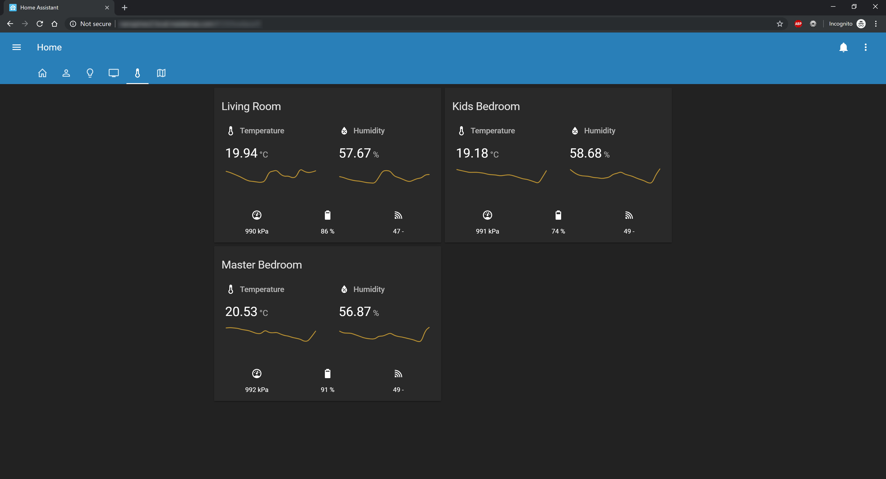

# Home Assistant Configuration 

**My personal Home Assistant configuration!**

I based my configurations in what others have built, so I'm now sharing this so others can learn from it too!

Feel free to send questions or PR's with improvements!

## Screenshots

### Home

### People

### Lights

### Media

### Ambient

### Map

