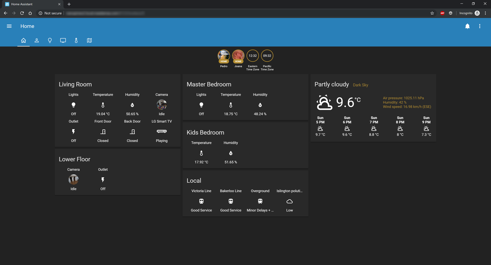
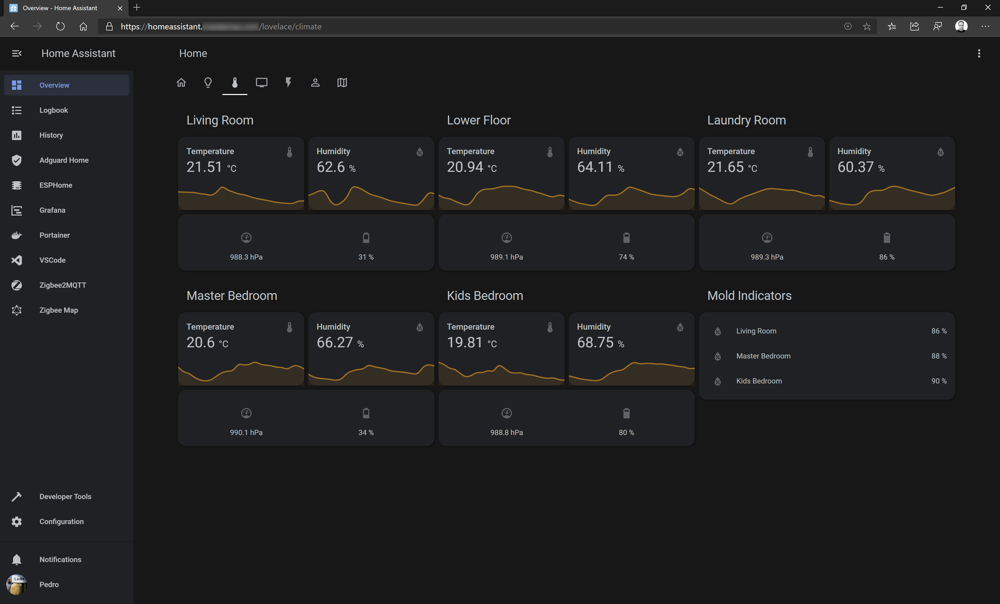
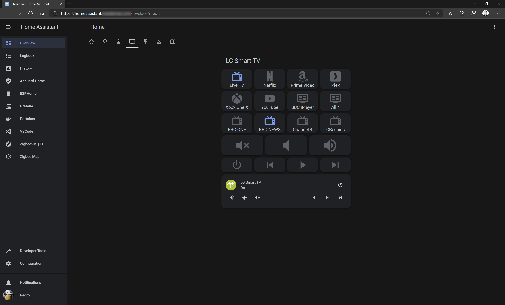
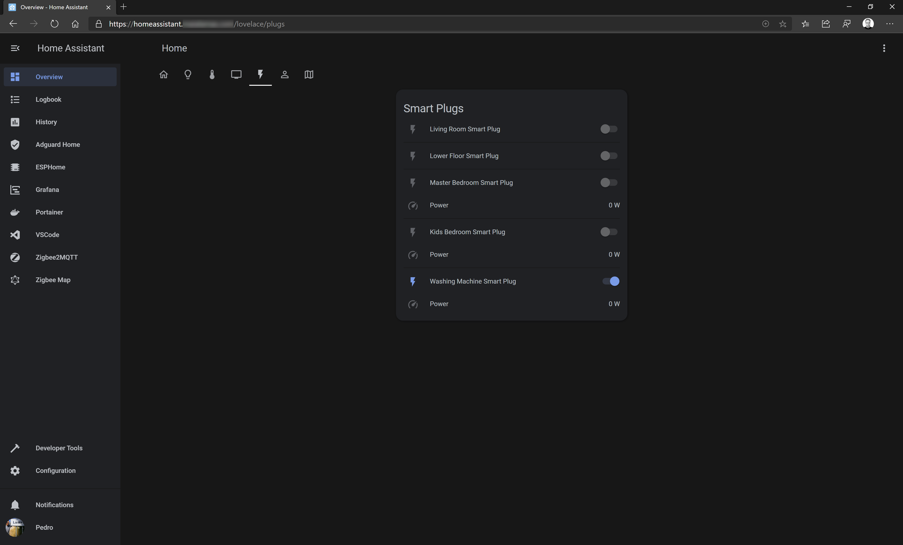
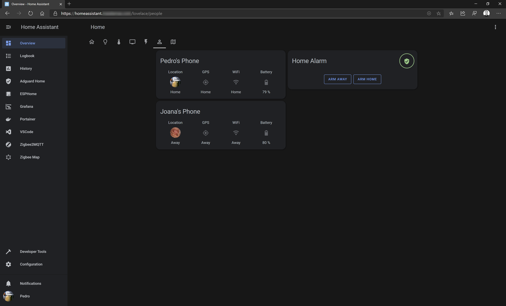
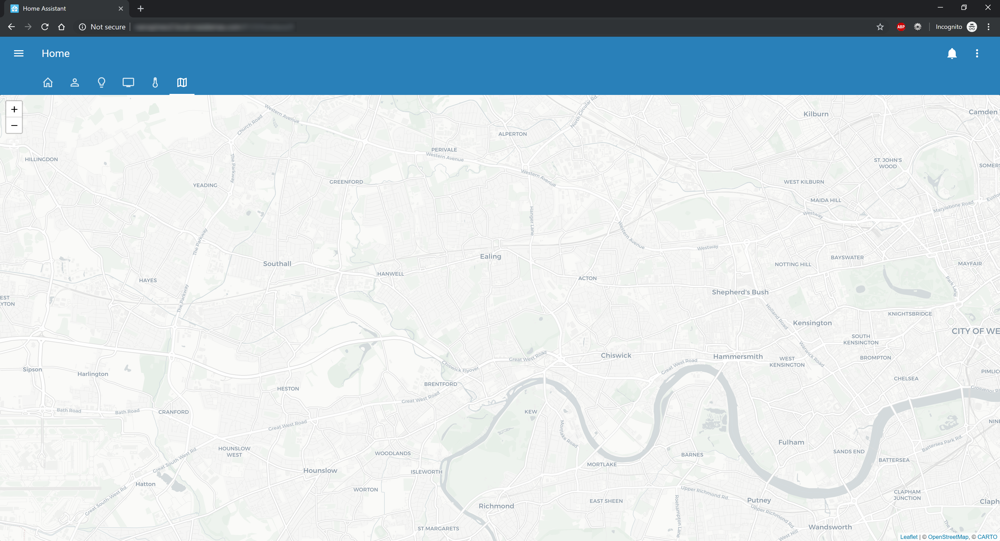

# Home Assistant Configuration

[/badge.svg)](https://github.com/pedrolamas/home-assistant-config/actions 'Build Status')
[/badge.svg)](https://github.com/pedrolamas/home-assistant-config/actions 'Build Status')

**My personal Home Assistant configuration!**

I based my configurations in what others have built, so I'm now sharing this so others can learn from it too!

Feel free to send questions or PR's with improvements!

## Screenshots

### Home

### Lights

### Climate

### Media

### Smart plugs

### People

### Map

## License

MIT
